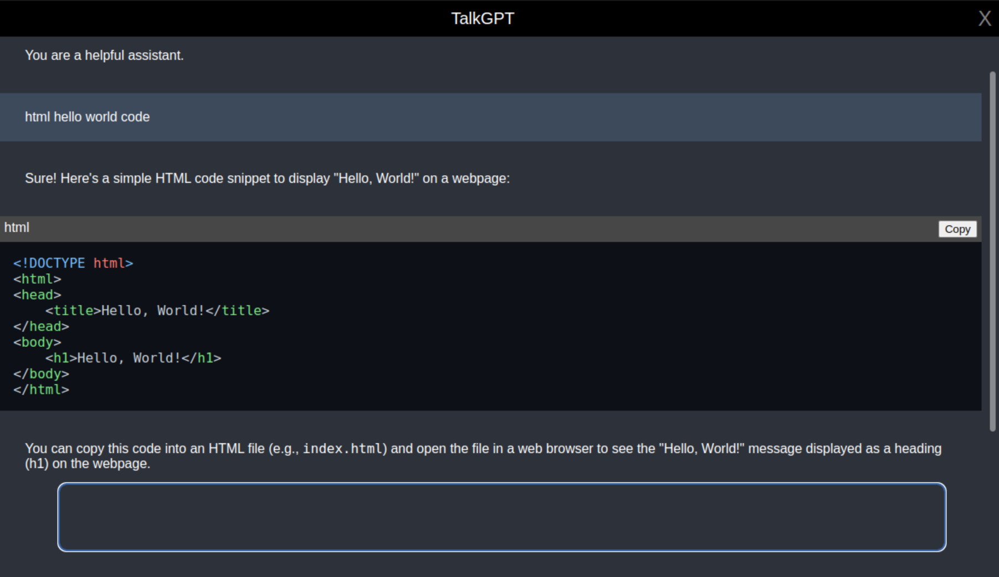

## TalkGPT
<link rel="stylesheet" type="text/css" href="./assets/readme.css">

<!-- 
 -->
  <!-- 

    

      
    

  
 -->
  <!-- 

    
TalkGPT

  
 -->
<!-- 
 -->

#### Desktop App that connects to GPT_3.5_Turbo and provides Chat Completion through API.  

    

      
    

## Run  

#### Dependecy Installation

    yarn

#### create a .env file at the root of the project & enter the following

    OPENAI_API_KEY=your_api_key

replace `your_api_key` with actual secret API key from OpenAI

#### Generate platform specific executables

    yarn package

### Works standalone as well as with [Able](https://github.com/umangrajpara13/Able) for Speech-to-Text Capability
